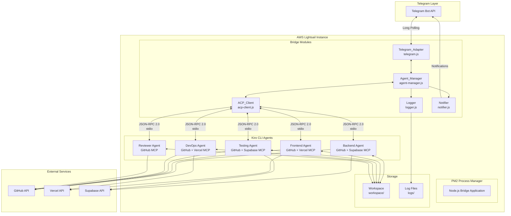
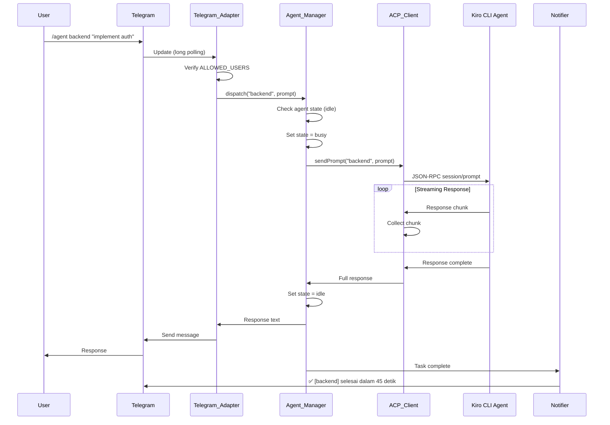
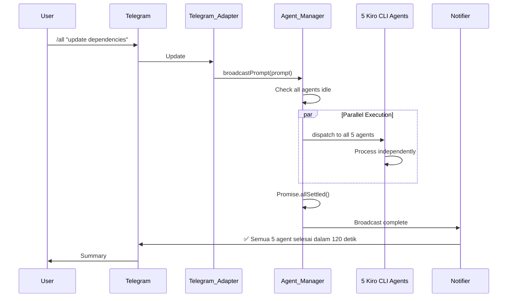
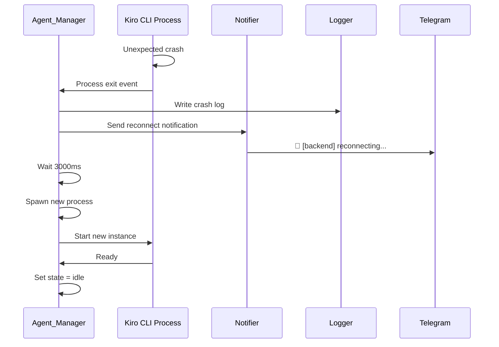

# Design Document: Telegram-Kiro-Bot

## Overview

The Telegram-Kiro-Bot system is a multi-agent orchestration platform that bridges Telegram messaging with five specialized Kiro CLI agents running in parallel on AWS Lightsail. The system enables mobile-first development workflows where developers send prompts via Telegram and receive coordinated responses from specialized AI agents.

### System Architecture

The system consists of three primary layers:

1. **Interface Layer**: Telegram Bot API integration for receiving commands and delivering responses
2. **Orchestration Layer**: Node.js Bridge application managing agent lifecycle, task distribution, and communication
3. **Execution Layer**: Five parallel Kiro CLI child processes, each with specialized roles and MCP server access

### Key Design Principles

- **Fault Isolation**: Individual agent crashes do not affect the Bridge or other agents
- **Parallel Execution**: Multiple agents can process tasks simultaneously without blocking
- **Stateless Communication**: Each agent interaction is independent, enabling clean recovery from failures
- **Security-First**: Authentication, credential protection, and workspace isolation are enforced at all layers

---

## Architecture

### High-Level Architecture Diagram



### Component Responsibilities

#### Telegram_Adapter (telegram.js)
- Establishes long polling connection to Telegram Bot API
- Authenticates incoming messages against ALLOWED_USERS list
- Parses commands and routes to appropriate handlers
- Sends responses and notifications back to Telegram chats
- Manages message splitting for responses exceeding 4096 characters
- Sends typing indicators during long-running operations

#### Agent_Manager (agent-manager.js)
- Spawns and maintains 5 Kiro CLI child processes at startup
- Tracks agent state (idle/busy/unavailable)
- Dispatches prompts to agents based on routing rules
- Implements crash detection and automatic reconnection
- Coordinates parallel execution for broadcast commands
- Handles graceful shutdown of all agents

#### ACP_Client (acp-client.js)
- Implements JSON-RPC 2.0 client over stdio
- Sends `session/prompt` requests to Kiro CLI processes
- Collects streaming response chunks
- Auto-approves tool call requests
- Propagates errors to Agent_Manager
- Maintains request/response correlation

#### Logger (logger.js)
- Writes structured JSON logs per agent
- Implements log rotation based on file size
- Maintains system-level logs for Bridge operations
- Provides log query interface for `/logs` command

#### Notifier (notifier.js)
- Sends task completion notifications to NOTIFY_CHAT_ID
- Sends progress updates at configurable intervals
- Sends crash and reconnection notifications
- Formats broadcast completion summaries

### Communication Flow

#### Single Agent Command Flow


#### Broadcast Command Flow


#### Crash Recovery Flow


---

## Components and Interfaces

### Bridge Application

**Entry Point**: `bridge/index.js`

**Initialization Sequence**:
1. Load environment variables from `bridge/.env`
2. Validate required environment variables (BOT_TOKEN, ALLOWED_USERS, KIRO_CLI_PATH, WORKSPACE_PATH)
3. Initialize Logger module
4. Initialize Agent_Manager (spawn 5 agents)
5. Initialize Telegram_Adapter (start polling)
6. Initialize Notifier
7. Register signal handlers (SIGTERM, SIGINT)

**Module Dependencies**:
```javascript
// bridge/index.js
const TelegramAdapter = require('./telegram');
const AgentManager = require('./agent-manager');
const Logger = require('./logger');
const Notifier = require('./notifier');
```

### Telegram_Adapter Module

**Interface**:
```typescript
interface TelegramAdapter {
  // Initialize and start long polling
  start(): Promise<void>;
  
  // Stop polling and cleanup
  stop(): Promise<void>;
  
  // Send message to chat
  sendMessage(chatId: string, text: string): Promise<void>;
  
  // Send typing indicator
  sendTypingIndicator(chatId: string): Promise<void>;
  
  // Event handlers
  on(event: 'message', handler: (msg: Message) => void): void;
  on(event: 'command', handler: (cmd: Command) => void): void;
}

interface Message {
  chatId: string;
  userId: string;
  text: string;
  timestamp: number;
}

interface Command {
  name: string; // 'agent', 'all', 'agents', 'status', 'logs', 'cancel'
  args: string[];
  chatId: string;
  userId: string;
}
```

**Command Parsing Rules**:
- `/agent <name> <prompt>` → Route to specific agent
- `/all <prompt>` → Broadcast to all agents
- `/agents` → List all agents with state
- `/status` → Show agent states
- `/logs <name>` → Retrieve agent logs
- `/cancel <name>` → Cancel agent task
- Plain text → Route to backend agent (default)

**Authentication Flow**:
```javascript
function authenticateMessage(message) {
  const allowedUsers = process.env.ALLOWED_USERS.split(',').map(id => id.trim());
  if (!allowedUsers.includes(message.userId.toString())) {
    // Silently ignore - no response sent
    return false;
  }
  return true;
}
```

### Agent_Manager Module

**Interface**:
```typescript
interface AgentManager {
  // Spawn all agents at startup
  initialize(): Promise<void>;
  
  // Dispatch prompt to specific agent
  dispatch(agentName: string, prompt: string, context: Context): Promise<string>;
  
  // Broadcast prompt to all agents
  broadcastPrompt(prompt: string, context: Context): Promise<BroadcastResult>;
  
  // Cancel running task
  cancelTask(agentName: string): Promise<void>;
  
  // Get agent state
  getAgentState(agentName: string): AgentState;
  
  // Get all agent states
  getAllAgentStates(): Map<string, AgentState>;
  
  // Graceful shutdown
  shutdown(): Promise<void>;
}

type AgentState = 'idle' | 'busy' | 'unavailable';

interface Context {
  chatId: string;
  userId: string;
  messageId: string;
}

interface BroadcastResult {
  successful: string[]; // Agent names
  failed: Array<{ agent: string; error: string }>;
  duration: number; // milliseconds
}
```

**Agent Configuration Loading**:
```javascript
// Load from .kiro/agents/<name>.json
function loadAgentConfig(agentName) {
  const configPath = path.join(
    process.env.WORKSPACE_PATH,
    '.kiro/agents',
    `${agentName}.json`
  );
  
  const config = JSON.parse(fs.readFileSync(configPath, 'utf8'));
  
  return {
    name: config.name,
    description: config.description,
    systemPrompt: config.systemPrompt,
    tools: config.tools,
    mcpServers: config.mcpServers
  };
}
```

**Agent Spawning**:
```javascript
function spawnAgent(agentName) {
  const config = loadAgentConfig(agentName);
  const mcpConfig = loadMCPConfig(); // from .kiro/settings/mcp.json
  
  const child = spawn(process.env.KIRO_CLI_PATH, ['acp'], {
    cwd: process.env.WORKSPACE_PATH,
    stdio: ['pipe', 'pipe', 'pipe'],
    env: {
      ...process.env,
      KIRO_AGENT_NAME: agentName,
      KIRO_AGENT_CONFIG: JSON.stringify(config),
      KIRO_MCP_CONFIG: JSON.stringify(mcpConfig)
    }
  });
  
  return child;
}
```

**Crash Detection and Recovery**:
```javascript
function setupCrashRecovery(agentName, childProcess) {
  let reconnectAttempts = 0;
  const MAX_RECONNECT_ATTEMPTS = 10;
  
  childProcess.on('exit', (code, signal) => {
    if (code !== 0 && reconnectAttempts < MAX_RECONNECT_ATTEMPTS) {
      logger.log({
        level: 'error',
        agent: agentName,
        type: 'agent_crash',
        message: `Exit code ${code}, signal ${signal}`,
        action: 'reconnecting'
      });
      
      notifier.send(`🔄 [${agentName}] reconnecting...`);
      
      setTimeout(() => {
        reconnectAttempts++;
        const newChild = spawnAgent(agentName);
        setupCrashRecovery(agentName, newChild);
      }, 3000);
    } else if (reconnectAttempts >= MAX_RECONNECT_ATTEMPTS) {
      agentStates.set(agentName, 'unavailable');
      notifier.send(`❌ [${agentName}] gagal restart setelah ${MAX_RECONNECT_ATTEMPTS} percobaan`);
    }
  });
}
```

**Parallel Execution**:
```javascript
async function broadcastPrompt(prompt, context) {
  const startTime = Date.now();
  const agentNames = ['backend', 'frontend', 'testing', 'devops', 'reviewer'];
  
  // Check all agents are idle
  for (const name of agentNames) {
    if (agentStates.get(name) !== 'idle') {
      throw new Error(`Agent ${name} is currently ${agentStates.get(name)}`);
    }
  }
  
  // Dispatch to all agents in parallel
  const results = await Promise.allSettled(
    agentNames.map(name => dispatch(name, prompt, context))
  );
  
  const duration = Date.now() - startTime;
  
  // Categorize results
  const successful = [];
  const failed = [];
  
  results.forEach((result, index) => {
    if (result.status === 'fulfilled') {
      successful.push(agentNames[index]);
    } else {
      failed.push({
        agent: agentNames[index],
        error: result.reason.message
      });
    }
  });
  
  return { successful, failed, duration };
}
```

### ACP_Client Module

**Interface**:
```typescript
interface ACPClient {
  // Send prompt to agent
  sendPrompt(agentName: string, prompt: string): Promise<string>;
  
  // Send cancellation signal
  cancelSession(agentName: string): Promise<void>;
  
  // Check if agent is ready
  isReady(agentName: string): boolean;
}
```

**JSON-RPC 2.0 Message Format**:

Request:
```json
{
  "jsonrpc": "2.0",
  "id": "req-1234567890",
  "method": "session/prompt",
  "params": {
    "prompt": "Implement user authentication",
    "autoApprove": true
  }
}
```

Response (streaming chunks):
```json
{
  "jsonrpc": "2.0",
  "id": "req-1234567890",
  "result": {
    "type": "chunk",
    "content": "I'll implement authentication..."
  }
}
```

Response (complete):
```json
{
  "jsonrpc": "2.0",
  "id": "req-1234567890",
  "result": {
    "type": "complete",
    "content": "Full response text here"
  }
}
```

Error:
```json
{
  "jsonrpc": "2.0",
  "id": "req-1234567890",
  "error": {
    "code": -32603,
    "message": "Internal error",
    "data": "Stack trace or additional info"
  }
}
```

**Implementation**:
```javascript
class ACPClient {
  constructor() {
    this.agents = new Map(); // agentName -> { process, buffer, pendingRequests }
  }
  
  async sendPrompt(agentName, prompt) {
    const agent = this.agents.get(agentName);
    if (!agent) {
      throw new Error(`Agent ${agentName} not found`);
    }
    
    const requestId = `req-${Date.now()}-${Math.random()}`;
    const request = {
      jsonrpc: '2.0',
      id: requestId,
      method: 'session/prompt',
      params: {
        prompt,
        autoApprove: true
      }
    };
    
    // Write to stdin
    agent.process.stdin.write(JSON.stringify(request) + '\n');
    
    // Wait for response
    return new Promise((resolve, reject) => {
      agent.pendingRequests.set(requestId, { resolve, reject, chunks: [] });
    });
  }
  
  setupStdioHandlers(agentName, childProcess) {
    const agent = this.agents.get(agentName);
    let buffer = '';
    
    childProcess.stdout.on('data', (data) => {
      buffer += data.toString();
      
      // Process complete JSON-RPC messages (newline-delimited)
      const lines = buffer.split('\n');
      buffer = lines.pop(); // Keep incomplete line in buffer
      
      for (const line of lines) {
        if (line.trim()) {
          try {
            const message = JSON.parse(line);
            this.handleMessage(agentName, message);
          } catch (err) {
            logger.error(`Failed to parse JSON-RPC message: ${err.message}`);
          }
        }
      }
    });
  }
  
  handleMessage(agentName, message) {
    const agent = this.agents.get(agentName);
    const pending = agent.pendingRequests.get(message.id);
    
    if (!pending) return;
    
    if (message.error) {
      pending.reject(new Error(message.error.message));
      agent.pendingRequests.delete(message.id);
    } else if (message.result) {
      if (message.result.type === 'chunk') {
        pending.chunks.push(message.result.content);
      } else if (message.result.type === 'complete') {
        const fullResponse = pending.chunks.join('') + message.result.content;
        pending.resolve(fullResponse);
        agent.pendingRequests.delete(message.id);
      }
    }
  }
}
```

### Logger Module

**Interface**:
```typescript
interface Logger {
  // Write log entry
  log(entry: LogEntry): void;
  
  // Query logs for agent
  queryLogs(agentName: string, limit: number): LogEntry[];
  
  // Flush pending logs
  flush(): Promise<void>;
}

interface LogEntry {
  ts: string; // ISO 8601
  level: 'info' | 'warn' | 'error';
  agent: string;
  type: 'prompt' | 'tool_call' | 'response_complete' | 'agent_crash';
  [key: string]: any; // Additional fields based on type
}
```

**Log Entry Types**:

Prompt:
```json
{
  "ts": "2025-01-15T10:30:45.123Z",
  "level": "info",
  "agent": "backend",
  "type": "prompt",
  "from": "123456789",
  "text": "Implement user authentication"
}
```

Tool Call:
```json
{
  "ts": "2025-01-15T10:30:47.456Z",
  "level": "info",
  "agent": "backend",
  "type": "tool_call",
  "tool": "fsWrite",
  "path": "src/auth.js"
}
```

Response Complete:
```json
{
  "ts": "2025-01-15T10:31:30.789Z",
  "level": "info",
  "agent": "backend",
  "type": "response_complete",
  "duration_ms": 45633,
  "chars": 2847
}
```

Agent Crash:
```json
{
  "ts": "2025-01-15T10:32:15.012Z",
  "level": "error",
  "agent": "backend",
  "type": "agent_crash",
  "message": "Exit code 1, signal null",
  "action": "reconnecting"
}
```

**Log Rotation**:
```javascript
class Logger {
  constructor() {
    this.logDir = process.env.LOG_DIR || './logs';
    this.maxSizeMB = parseInt(process.env.LOG_MAX_SIZE_MB || '10');
    this.retainDays = parseInt(process.env.LOG_RETAIN_DAYS || '7');
    this.streams = new Map(); // agentName -> WriteStream
  }
  
  log(entry) {
    const logFile = path.join(this.logDir, `agent-${entry.agent}.log`);
    
    // Check file size and rotate if needed
    if (this.shouldRotate(logFile)) {
      this.rotateLog(logFile);
    }
    
    // Write JSON line
    const stream = this.getStream(entry.agent);
    stream.write(JSON.stringify(entry) + '\n');
  }
  
  shouldRotate(logFile) {
    try {
      const stats = fs.statSync(logFile);
      return stats.size >= this.maxSizeMB * 1024 * 1024;
    } catch {
      return false;
    }
  }
  
  rotateLog(logFile) {
    const timestamp = new Date().toISOString().replace(/[:.]/g, '-');
    const rotatedFile = `${logFile}.${timestamp}`;
    fs.renameSync(logFile, rotatedFile);
    
    // Clean old logs
    this.cleanOldLogs();
  }
  
  cleanOldLogs() {
    const cutoffTime = Date.now() - (this.retainDays * 24 * 60 * 60 * 1000);
    const files = fs.readdirSync(this.logDir);
    
    for (const file of files) {
      if (file.endsWith('.log')) continue; // Keep current logs
      
      const filePath = path.join(this.logDir, file);
      const stats = fs.statSync(filePath);
      
      if (stats.mtimeMs < cutoffTime) {
        fs.unlinkSync(filePath);
      }
    }
  }
}
```

### Notifier Module

**Interface**:
```typescript
interface Notifier {
  // Send notification to NOTIFY_CHAT_ID
  send(message: string): Promise<void>;
  
  // Send progress update
  sendProgress(agentName: string, elapsedSeconds: number): Promise<void>;
  
  // Send completion notification
  sendCompletion(agentName: string, durationSeconds: number): Promise<void>;
  
  // Send error notification
  sendError(agentName: string, error: string): Promise<void>;
  
  // Send broadcast summary
  sendBroadcastSummary(result: BroadcastResult): Promise<void>;
}
```

**Notification Formats**:
- Success: `✅ [backend] selesai dalam 45 detik`
- Error: `❌ [backend] gagal: Connection timeout`
- Progress: `⏳ [backend] masih berjalan... (60s)`
- Reconnect: `🔄 [backend] reconnecting...`
- Broadcast: `✅ Semua 5 agent selesai dalam 120 detik`

**Progress Tracking**:
```javascript
class Notifier {
  constructor(telegramAdapter) {
    this.telegram = telegramAdapter;
    this.chatId = process.env.NOTIFY_CHAT_ID;
    this.progressInterval = parseInt(process.env.PROGRESS_INTERVAL_SEC || '30') * 1000;
    this.progressTimers = new Map(); // agentName -> intervalId
  }
  
  startProgressTracking(agentName) {
    let elapsed = 0;
    
    const intervalId = setInterval(() => {
      elapsed += this.progressInterval / 1000;
      this.sendProgress(agentName, elapsed);
    }, this.progressInterval);
    
    this.progressTimers.set(agentName, intervalId);
  }
  
  stopProgressTracking(agentName) {
    const intervalId = this.progressTimers.get(agentName);
    if (intervalId) {
      clearInterval(intervalId);
      this.progressTimers.delete(agentName);
    }
  }
}
```

---

## Data Models

### Agent Configuration

**File**: `.kiro/agents/<name>.json`

```json
{
  "name": "backend",
  "description": "Backend development specialist with database and API expertise",
  "systemPrompt": "You are a backend development expert specializing in Node.js, databases, and API design. You have access to GitHub for code management and Supabase for database operations.",
  "tools": [
    "readFile",
    "fsWrite",
    "strReplace",
    "executePwsh",
    "grepSearch"
  ],
  "mcpServers": ["github", "supabase"]
}
```

**Agent Roles and MCP Access**:

| Agent | Role | MCP Servers |
|-------|------|-------------|
| backend | Backend development, API, database | GitHub, Supabase |
| frontend | UI/UX, components, styling | GitHub, Vercel |
| testing | Test writing, quality assurance | GitHub, Supabase |
| devops | Deployment, infrastructure, CI/CD | GitHub, Vercel |
| reviewer | Code review, best practices | GitHub |

### MCP Server Configuration

**File**: `.kiro/settings/mcp.json`

```json
{
  "mcpServers": {
    "github": {
      "command": "npx",
      "args": ["-y", "@modelcontextprotocol/server-github"],
      "env": {
        "GITHUB_TOKEN": "${GITHUB_TOKEN}"
      }
    },
    "supabase": {
      "command": "npx",
      "args": ["-y", "@modelcontextprotocol/server-supabase"],
      "env": {
        "SUPABASE_URL": "${SUPABASE_URL}",
        "SUPABASE_SERVICE_ROLE_KEY": "${SUPABASE_SERVICE_ROLE_KEY}"
      }
    },
    "vercel": {
      "command": "npx",
      "args": ["-y", "@modelcontextprotocol/server-vercel"],
      "env": {
        "VERCEL_TOKEN": "${VERCEL_TOKEN}"
      }
    }
  }
}
```

### Environment Variables

**File**: `bridge/.env`

```bash
# Required
BOT_TOKEN=1234567890:ABCdefGHIjklMNOpqrsTUVwxyz
ALLOWED_USERS=123456789,987654321
KIRO_CLI_PATH=/usr/local/bin/kiro-cli
WORKSPACE_PATH=/home/ubuntu/workspace

# MCP Tokens
GITHUB_TOKEN=ghp_xxxxxxxxxxxxxxxxxxxx
VERCEL_TOKEN=xxxxxxxxxxxxxxxxxxxxxxxxx
SUPABASE_URL=https://xxxxx.supabase.co
SUPABASE_SERVICE_ROLE_KEY=eyJhbGciOiJIUzI1NiIsInR5cCI6IkpXVCJ9...

# Optional
NOTIFY_CHAT_ID=123456789
LOG_DIR=./logs
LOG_MAX_SIZE_MB=10
LOG_RETAIN_DAYS=7
PROGRESS_INTERVAL_SEC=30
```

### Agent State Model

```typescript
interface AgentState {
  name: string;
  state: 'idle' | 'busy' | 'unavailable';
  currentTask?: {
    prompt: string;
    startTime: number;
    context: Context;
  };
  lastActivity: number;
  reconnectAttempts: number;
  processId: number;
}
```

### Session Context

```typescript
interface Context {
  chatId: string;        // Telegram chat ID
  userId: string;        // Telegram user ID
  messageId: string;     // Original message ID
  timestamp: number;     // Request timestamp
}
```

---

## Correctness Properties

*A property is a characteristic or behavior that should hold true across all valid executions of a system—essentially, a formal statement about what the system should do. Properties serve as the bridge between human-readable specifications and machine-verifiable correctness guarantees.*

